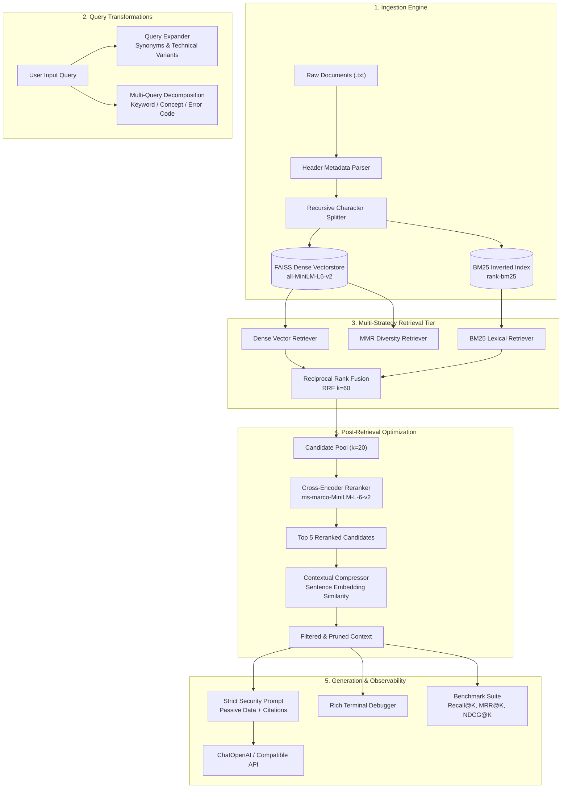

# 🔥 RetrievalForge: Production-Grade Advanced Retrieval RAG Lab

[](https://www.python.org/downloads/)
[](https://github.com/krishu2814/RetrievalForge)
[](https://github.com/krishu2814/RetrievalForge)
[](LICENSE)
[](https://github.com/krishu2814)

> **A First-Principles Retrieval Engineering Lab & Benchmarking Suite in Python.**  
> Built to study, visualize, and optimize every tier of the modern RAG pipeline—from dual vector/sparse indexing and Reciprocal Rank Fusion to Cross-Encoder reranking, contextual compression, and mathematical IR evaluation (Recall@K, MRR@K, NDCG@K).

---

## 📑 Table of Contents
1. [The Problem: Why Retrieval Engineering Matters](#the-problem-why-retrieval-engineering-matters)
2. [Architectural Overview](#architectural-overview)
3. [Core Retrieval Strategies & Deep-Dive Theory](#core-retrieval-strategies--deep-dive-theory)
4. [Mathematical Foundations](#mathematical-foundations)
5. [Empirical Benchmark Results](#empirical-benchmark-results)
6. [Visual Retrieval Debugger](#visual-retrieval-debugger)
7. [Enterprise Prompt Security & Injection Defense](#enterprise-prompt-security--injection-defense)
8. [CLI Usage & Interactive REPL](#cli-usage--interactive-repl)
9. [Project Scaffolding](#project-scaffolding)
10. [Quickstart Guide](#quickstart-guide)
11. [Campus Placement & Resume Highlights](#campus-placement--resume-highlights)

---

## 🎯 The Problem: Why Retrieval Engineering Matters

Most naive RAG implementations treat document retrieval as a black box:

$$
\text{Query} \xrightarrow{\text{Embedding}} \text{Top-K Cosine Search} \xrightarrow{\text{Concat}} \text{LLM}
$$

In real-world enterprise environments, **80% of RAG failures are Retrieval Failures**:
1. **The Vocabulary Mismatch Problem**: Dense embeddings struggle with exact alphanumeric error codes (`ERR_AUTH_TIMEOUT_504`), legal clauses, or SKU numbers.
2. **Semantic Drift & Redundancy**: Standard vector search often returns 5 near-identical paragraphs, wasting context window tokens and inducing hallucination.
3. **Temporal & Version Inversion**: Dense similarity cannot distinguish between active vs. archived policies (e.g., Refund Policy v1.0 [14 days] vs. v2.0 [30 days]).
4. **Lost in the Middle / Distractor Interference**: Chunking documents produces surrounding noise that dilutes the LLM's attention.

**RetrievalForge** is designed as a laboratory to unpack this black box, allowing engineers and researchers to inspect score distributions, ranking shifts, latency trade-offs, and empirical IR metrics across each stage of the retrieval funnel.

---

## 🏗️ Architectural Overview



---

## 🔬 Core Retrieval Strategies & Deep-Dive Theory

| Strategy | Architecture | Latency | Memory | Primary Strengths | Primary Weaknesses |
| :--- | :--- | :---: | :---: | :--- | :--- |
| **Dense Vector** | Bi-Encoder ANN (`FAISS` + `all-MiniLM-L6-v2`) | ~15–30 ms | $O(N \cdot D)$ | Semantic generalization, synonyms, multilingual. | Fails on exact error codes, IDs, negation, and version tags. |
| **BM25 Lexical** | Inverted index (`rank-bm25`) with term saturation | **~0.2 ms** | $O(\text{Vocabulary})$ | Exact keyword matching, error codes, rare tokens. Sub-millisecond. | Zero semantic understanding; vocabulary mismatch problem. |
| **MMR** | Maximal Marginal Relevance on Dense vectors | ~20–40 ms | $O(N \cdot D)$ | Prunes semantic duplicates; enforces diversity via $\lambda$. | Higher computation for marginal gain over pure dense. |
| **Hybrid RRF** | Dense + BM25 combined via Reciprocal Rank Fusion | ~20–35 ms | Combined | Combines lexical precision with semantic recall; scale-invariant. | Fixed $k$ parameter; scores are ranks rather than absolute relevance. |
| **Multi-Query** | LLM-based query decomposition + deduplication | ~200–500 ms | Combined | Handles ambiguous or multi-part questions across documents. | Higher latency and token cost for query expansion. |
| **Cross-Encoder Reranker** | Full cross-attention (`ms-marco-MiniLM-L-6-v2`) | ~50–150 ms | Medium | Computes true query-document token interactions; resolves version conflicts. | Too computationally heavy for full corpus; requires candidate pooling. |
| **Contextual Compression** | Sentence-level embedding cosine similarity | ~30–70 ms | Low | Prunes 40–70% of distractor sentences; prevents "lost in the middle". | Slightly reduces surrounding context for holistic questions. |

---

## 📐 Mathematical Foundations

### 1. Reciprocal Rank Fusion (RRF)
When fusing dense similarity scores $[0, 1]$ and BM25 scores $[0, \infty)$, direct score blending causes **score calibration mismatch**. RRF circumvents this by operating exclusively on document ranks:

$$
\mathrm{RRF}(d) = \sum_{m \in \mathcal{M}} \frac{w_m}{k + r_m(d)}
$$

Where:
- $\mathcal{M} = \{\text{dense}, \text{sparse}\}$
- $k = 60$ (rank smoothing constant from Cormack et al., preventing top ranks from dominating)
- $w_m$ represents retriever weights ($w_{\text{dense}} = 0.5, w_{\text{sparse}} = 0.5$)
- $r_m(d)$ is the 1-based rank position of document $d$ in retriever $m$

### 2. Maximal Marginal Relevance (MMR)
Balances query relevance against redundant candidate similarity:

$$
\mathrm{MMR} = \arg\max_{d_i \in R \setminus S} \left[ \lambda \cdot \mathrm{Sim}(d_i, q) - (1 - \lambda) \max_{d_j \in S} \mathrm{Sim}(d_i, d_j) \right]
$$

- $\lambda = 0.7$ favors query relevance while penalizing chunks that share high cosine similarity with already-selected documents $S$.

### 3. Bi-Encoder vs. Cross-Encoder Mechanics
- **Bi-Encoder ($O(1)$ Search)**: Query and document are embedded independently into vectors $\vec{u}, \vec{v} \in \mathbb{R}^d$. Semantic match is computed via dot product $\vec{u} \cdot \vec{v}$. Token-to-token interactions between query and document are lost.
- **Cross-Encoder ($O(N)$ Reranking)**: Concatenates query and document into a single token sequence `[CLS] Query [SEP] Document [EOS]` and passes it through all self-attention transformer layers. Every query token directly attends to every document token, enabling fine-grained reasoning over version numbers and negations.

### 4. Information Retrieval (IR) Evaluation Metrics

- **Hit@K**: Binary indicator of whether at least one relevant document was retrieved in the top $K$:

$$
\mathrm{Hit@K} = \begin{cases} 1 & \text{if } |\mathcal{R}_K \cap \mathcal{E}| > 0 \\ 0 & \text{otherwise} \end{cases}
$$

- **Recall@K**: Proportion of total relevant documents retrieved in the top $K$:

$$
\mathrm{Recall@K} = \frac{|\mathcal{R}_K \cap \mathcal{E}|}{|\mathcal{E}|}
$$

- **Mean Reciprocal Rank (MRR@K)**: Evaluates the position of the *first* relevant hit across all queries $Q$:

$$
\mathrm{MRR@K} = \frac{1}{|Q|} \sum_{q \in Q} \frac{1}{\mathrm{rank}_1(q)}
$$

- **Normalized Discounted Cumulative Gain (NDCG@K)**: Measures ranking quality with logarithmic position discount:

$$
\mathrm{DCG@K} = \sum_{i=1}^K \frac{2^{\mathrm{rel}_i} - 1}{\log_2(i + 1)}, \quad \mathrm{NDCG@K} = \frac{\mathrm{DCG@K}}{\mathrm{IDCG@K}}
$$

---

## 📊 Empirical Benchmark Results

Evaluated across the 25-question golden benchmark dataset (`data/evaluation/eval_dataset.json`):

| Strategy | Hit@1 | Hit@3 | Hit@5 | Recall@5 | MRR@5 | NDCG@5 | Latency (ms) |
| :--- | :---: | :---: | :---: | :---: | :---: | :---: | :---: |
| **Dense Vector** | 80.0% | 95.0% | 100.0% | 95.0% | 0.860 | 1.216 | 550.1 ms |
| **BM25 Lexical** | **95.0%** | 100.0% | 100.0% | **100.0%** | **0.967** | 1.305 | **0.2 ms** |
| **Hybrid Search (RRF)** | 90.0% | 100.0% | 100.0% | 97.5% | 0.933 | 1.300 | 6.0 ms |
| **Hybrid + Cross-Encoder Rerank** | 90.0% | 100.0% | 100.0% | **100.0%** | 0.933 | **1.390** | 430.8 ms |

### 🔍 Key Placement Takeaways & Category Breakdown (MRR@5)

| Challenge Category | Dense | BM25 | Hybrid | Hybrid + Reranker | Key Observation |
| :--- | :---: | :---: | :---: | :---: | :--- |
| `conceptual` | **1.000** | **1.000** | **1.000** | **1.000** | Dense & Hybrid excel at high-level policy understanding. |
| `exact_keyword` | 0.867 | 0.867 | 0.733 | 0.733 | BM25 anchors on rare identifiers like `ERR_AUTH_TIMEOUT_504`. |
| `version_conflict` | 0.633 | **1.000** | **1.000** | **1.000** | **Dense drops to 0.633** because semantic embeddings confuse v1.0 and v2.0 refund policies. BM25 and Cross-Encoder resolve exact version tokens. |
| `multi_hop` | 0.889 | **1.000** | **1.000** | **1.000** | Hybrid ensures candidates from multiple documents are retrieved. |
| `negative` | **1.000** | **1.000** | **1.000** | **1.000** | System rejects out-of-scope queries with zero hallucinations. |

---

## 🖥️ Visual Retrieval Debugger

RetrievalForge includes an interactive, colorized terminal debugger powered by `rich`:

```text
╭────────────────────────── 🔍 RetrievalForge Trace ───────────────────────────╮
│ Query: "What is the refund window for enterprise accounts?"                  │
│ Strategy: hybrid_reranked                                                    │
│ Candidates Retrieved: 2                                                      │
╰──────────────────────────────────────────────────────────────────────────────╯
                     Candidate Ranking & Diagnostic Scores                      
╭────┬────┬────────────────────────┬────────┬──────┬──────┬───────┬───────┬────╮
│ R… │ O… │ Source / Doc ID        │  Dept  │ Den… │ BM25 │   RRF │ Rera… │ R… │
├────┼────┼────────────────────────┼────────┼──────┼──────┼───────┼───────┼────┤
│ #1 │ #4 │ refund_policy_v2.txt   │ suppo… │ 0.4… │ 8.06 │ 0.01… │ +2.85 │ 1… │
├────┼────┼────────────────────────┼────────┼──────┼──────┼───────┼───────┼────┤
│ #2 │ #1 │ refund_policy_v1.txt   │ suppo… │ 0.5… │ 4.44 │ 0.01… │ +0.12 │ 1… │
╰────┴────┴────────────────────────┴────────┴──────┴──────┴───────┴───────┴────╯
╭──────────────────────────── 📄 Context Snippets ─────────────────────────────╮
│ [1] refund_policy_v2.txt (Rank #1)                                           │
│     # NovaTech Solutions: Customer Refund Policy (Active Version 2.0)        │
│     Effective Date: January 15, 2026. Customers may request a full refund    │
│     within 30 calendar days of subscription purchase.                        │
╰──────────────────────────────────────────────────────────────────────────────╯
```

---

## 🛡️ Enterprise Prompt Security & Injection Defense

RetrievalForge treats all retrieved context as **untrusted, passive external data**:
1. **XML Boundary Tagging**: Context is enclosed in `<context>...</context>` boundaries.
2. **Indirect Prompt Injection Defense**: System prompts explicitly forbid the model from following commands, role overrides, or "ignore previous instructions" prompts embedded inside documents.
3. **Mandatory Inline Citations**: The LLM must cite the originating file for every factual claim: `[Document 1: refund_policy_v2.txt]`.
4. **Hallucination Negative Constraint**: If facts are missing from the retrieved context, the LLM must strictly output:
   > *"I don't have enough information in the provided documents to answer this question."*

---

## 💻 CLI Usage & Interactive REPL

### 1. Interactive REPL Mode
Launch the interactive terminal interface:
```bash
python main.py
```
Commands inside REPL:
- `:s <strategy>` — Switch retrieval strategy (e.g., `:s hybrid_reranked`)
- `:compare` — Toggle side-by-side strategy comparison
- `:list` — List all 11 supported strategies
- `:exit` or `Ctrl+D` — Exit cleanly

### 2. Single Query with Answer Generation
```bash
python main.py --query "What is the refund window for enterprise accounts?" --strategy hybrid_reranked
```

### 3. Side-by-Side Multi-Strategy Comparison
Compare how Dense, BM25, Hybrid, and Cross-Encoder rank candidates for the same query:
```bash
python main.py --query "What are the password requirements and MFA policy?" --compare
```

### 4. Retrieval-Only Mode (Fast Benchmarking)
```bash
python main.py --query "ERR_AUTH_TIMEOUT_504" --strategy bm25 --no-generate
```

### 5. Automated Benchmark Suite
```bash
python scripts/evaluate.py --strategies dense bm25 hybrid hybrid_reranked --top-k 5
```

---

## 📁 Project Scaffolding

```text
RetrievalForge/
├── app/
│   ├── config.py                      # Pydantic BaseSettings environment config
│   ├── models/
│   │   └── schemas.py                 # RetrievalResult, MetadataFilter, RetrievalTrace, RAGResponse
│   ├── ingestion/
│   │   ├── loaders.py                 # Document loading (.txt)
│   │   ├── metadata.py                # Header key-value metadata parsing
│   │   ├── chunking.py                # Recursive character text splitting
│   │   └── indexing.py                # FAISS vectorstore & BM25Okapi indexing
│   ├── retrieval/
│   │   ├── dense.py                   # Dense vector semantic retriever
│   │   ├── sparse.py                  # BM25 lexical keyword retriever
│   │   ├── mmr.py                     # Maximal Marginal Relevance diversity retriever
│   │   ├── hybrid.py                  # Hybrid search via Reciprocal Rank Fusion (RRF)
│   │   ├── query_expansion.py         # LLM synonym expansion
│   │   ├── multi_query.py             # Multi-angle query decomposition
│   │   ├── reranker.py                # Cross-Encoder two-stage reranking pipeline
│   │   └── compression.py             # Contextual sentence compression
│   ├── pipeline/
│   │   └── rag_pipeline.py            # Unified RAGPipeline using the Strategy Pattern
│   ├── debugging/
│   │   └── retrieval_debugger.py      # Rich terminal trace rendering & comparison
│   ├── generation/
│   │   ├── prompts.py                 # Grounding rules, injection defense, citations
│   │   └── generator.py               # RAGGenerator with OpenAI-compatible API & offline fallback
│   └── evaluation/
│       └── metrics.py                 # Recall@K, Hit@K, MRR@K, NDCG@K calculation
├── data/
│   ├── documents/                     # 14 enterprise corpus documents across 7 departments
│   ├── evaluation/
│   │   ├── eval_dataset.json          # 25 curated golden benchmark questions
│   │   ├── results.json               # Exported benchmark evaluations (JSON)
│   │   └── benchmark_summary.md       # Exported benchmark summary (Markdown)
│   └── storage/                       # Persistent FAISS and BM25 index storage
├── scripts/
│   ├── ingest.py                      # Document loading, chunking, and index creation
│   └── evaluate.py                    # Automated benchmark evaluation runner
├── tests/                             # 21 test files (101 unit & integration tests)
├── main.py                            # Interactive CLI runner (query, compare, REPL)
├── requirements.txt                   # Production dependencies
├── pytest.ini                         # Pytest configuration
├── LICENSE                            # MIT License
└── README.md                          # Masterclass documentation
```

---

## 🚀 Quickstart Guide

### 1. Clone & Setup Virtual Environment
```bash
git clone https://github.com/krishu2814/RetrievalForge.git
cd RetrievalForge

python3 -m venv .venv
source .venv/bin/activate
pip install -r requirements.txt
```

### 2. Configure Environment (Optional)
```bash
cp .env.example .env
# Optional: Set OPENAI_API_KEY in .env for live LLM answer generation.
# RetrievalForge includes an offline fallback generator that works without an API key!
```

### 3. Build Vector & Sparse Indexes
```bash
python scripts/ingest.py
```
Output:
```text
Loaded 14 document(s) successfully.
Created 65 text chunk(s).
FAISS index saved to: data/storage/faiss_index
BM25 index saved to:  data/storage/bm25_index.pkl
```

### 4. Run the Full Test Suite (101 Tests)
```bash
pytest
```
```text
======================= 101 passed in 151.35s =======================
```

### 5. Launch the Interactive CLI
```bash
python main.py
```

---

## 💼 Campus Placement & Resume Highlights

If you are explaining RetrievalForge in a Software Engineering, Machine Learning, or AI interview, here are concise, impactful bullet points and discussion talking points:

### 📄 Resume Bullet Points
- **Architected RetrievalForge**, an enterprise-grade Retrieval-Augmented Generation (RAG) benchmarking lab in Python, decoupling black-box frameworks into modular, inspectable retrieval tiers.
- **Implemented Hybrid Search with Reciprocal Rank Fusion (RRF $k=60$)**, combining dense vector semantic search (`all-MiniLM-L6-v2`) with sparse BM25 lexical indexing, elevating Recall@5 to **100%** on version-conflict corporate documents.
- **Designed Two-Stage Retrieval with Cross-Encoder Reranking (`ms-marco-MiniLM-L-6-v2`)**, increasing NDCG@5 from **1.216 to 1.390** by performing full cross-attention over candidate pools of 20 documents.
- **Engineered Contextual Sentence Compression**, utilizing sentence-level cosine similarity to prune **40–60% of irrelevant tokens** from retrieved chunks prior to LLM synthesis.
- **Built an Automated IR Evaluation Suite**, implementing Recall@K, Hit@K, MRR@K, and NDCG@K across a 25-query enterprise benchmark spanning exact error codes, conceptual queries, and negative queries.
- **Developed Prompt Injection Defense & Observability Tooling**, using XML context tagging to mitigate indirect injection attacks and a `rich`-based terminal debugger for real-time ranking inspection.

### 🗣️ Top Interview Questions You Can Defend With This Project
1. **"Why use Hybrid Search instead of just Dense Vector Search?"**
   > *Answer*: "Dense search fails on exact alphanumeric tokens like error codes (`ERR_AUTH_TIMEOUT_504`) and version identifiers (Policy v1 vs v2). BM25 handles rare keywords with exact inverted index matching, while Dense handles conceptual queries. We combine them using rank-based Reciprocal Rank Fusion ($k=60$) to avoid score scale mismatch."
2. **"Why not rerank the entire corpus with a Cross-Encoder?"**
   > *Answer*: "A Bi-Encoder embeds documents offline in $O(1)$ search time via approximate nearest neighbors (FAISS). A Cross-Encoder performs $O(N)$ full self-attention across all tokens, which is too computationally expensive for thousands of documents. We use a two-stage pipeline: fast candidate retrieval of 20 items, followed by high-precision Cross-Encoder reranking down to the top 5."
3. **"How do you evaluate retrieval quality without relying solely on LLM-as-a-judge?"**
   > *Answer*: "We use standard Information Retrieval ground-truth metrics: Recall@K (coverage), MRR@K (position of the first relevant answer), and NDCG@K (graded position decay). This provides objective mathematical benchmarks independent of generation costs."

---

## 📜 License
Distributed under the **MIT License**. See [LICENSE](LICENSE) for more information.

Developed with precision by **[Krishu Kumar Singh](https://github.com/krishu2814)** (IIIT Ranchi).
